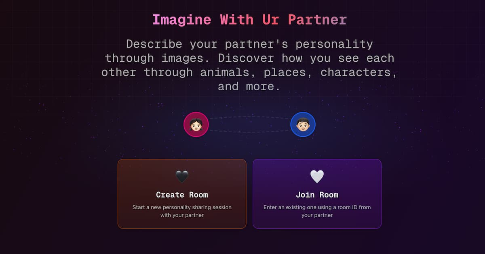

  

# UR Partner

**UR Partner** is a modern, real-time web app designed to help you connect, collaborate, and share experiences with others in a fun and interactive way.

## What is UR Partner?

UR Partner lets you create or join virtual rooms where you can chat, share ideas, and interact with others in real time. Whether you're working on a project, studying together, or just hanging out, UR Partner makes it easy and enjoyable to stay connected.

## Key Features

- **Instant Room Creation:** Start a new room with a single click and invite friends or colleagues instantly.
- **Real-Time Chat:** Communicate live with everyone in your room.
- **Personalized Experience:** Choose your personality, customize your profile, and make every session unique.
- **Fun Interactions:** Use emojis, reactions, and more to express yourself.
- **Mobile Friendly:** Enjoy a seamless experience on both desktop and mobile devices.

## Why You'll Love It

- **Simple & Intuitive:** No complicated setup—just join and start collaborating.
- **Privacy First:** Rooms are private by default. Share your room link only with people you trust.
- **Beautiful Design:** Clean, modern interface with delightful touches to make your experience enjoyable.

## Quick Start

1. **Create a Room:** Click "Create Room" and share the link with your friends.
2. **Join a Room:** Got a link? Just open it and jump right in!
3. **Collaborate:** Chat, share, and interact in real time.

---

  <i>Ready to connect? <b>UR Partner</b> is here to make every session memorable!</i>

